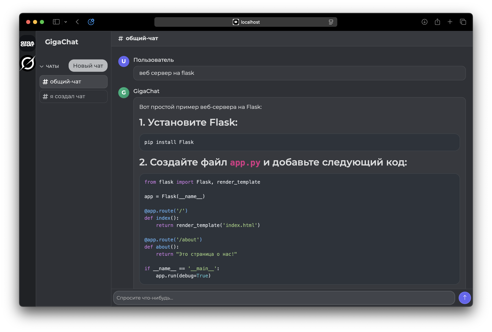
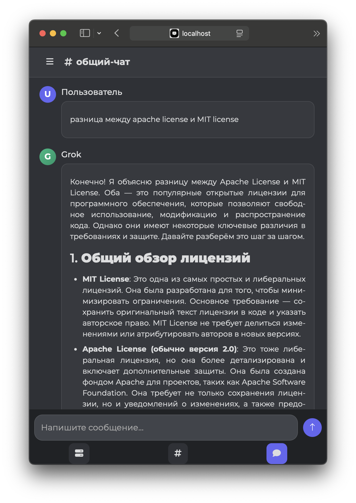

# **Chat-w-AI**

Проект, объединяющий работу с несколькими AI-ассистентами через API.

## 🔑 API-ключи

Для корректной работы необходимы два API-ключа:

- **GigaChat** — получить ключ можно на официальном сайте: [giga.chat](https://giga.chat)
- **Grok (Requesty)** — получить ключ можно на сайте: [requesty.ai](https://www.requesty.ai)

Убедитесь, что ключи сохранены в конфигурационном файле с названием `config.yaml`, пример указан в `example.yaml`.

## 🚀 Запуск
```bash
git clone https://github.com/shzuzu/chat-w-ai.git
cd chat-w-ai
go run main.go
```
### Сервер запустится на `localhost:8080`

## 📺 Демонстрация
### все скриншоты можно посмотреть [здесь](./images/images-preview.md)
- **десктопная версия ⤵️**


- **мобильная версия ⤵️**

