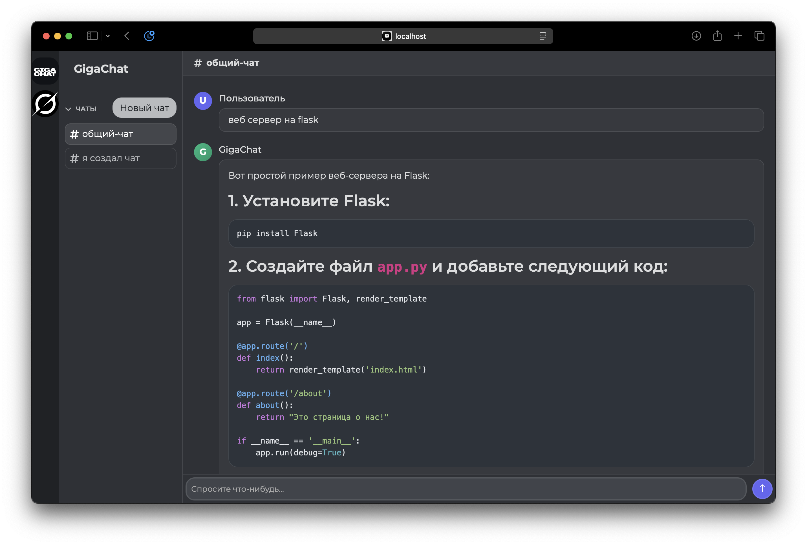

# **Chat-w-AI Studio** ✨

Современный, профессиональный и адаптивный веб-интерфейс для работы с передовыми моделями искусственного интеллекта (**GigaChat** от Сбер и **Grok** от xAI).



---

## 🌟 Ключевые возможности

- 🎨 **Современная дизайн-система**:
  - **4 темы оформления**: Dark Slate (по умолчанию), Midnight OLED, Light Minimal, Cyberpunk Neon.
  - Эффекты Glassmorphism, акцентные градиенты, плавные анимации и микро-взаимодействия.
  - Оптимизированная типографика на базе шрифтов *Plus Jakarta Sans* и *JetBrains Mono*.

- 💬 **Умный Prompt Composer**:
  - Автоматически расширяемое поле ввода (до 180px).
  - Горячие клавиши: `Enter` для отправки, `Shift + Enter` для переноса строки.
  - 🎙️ **Голосовой ввод (Speech-to-Text)** через Web Speech API.
  - 💡 Карточки быстрых подсказок (Prompt Starters) для мгновенного старта.
  - Счетчик символов и быстрый сброс текста.

- ⚡ **Премиальный рендеринг сообщений**:
  - **GitHub Flavored Markdown**: таблицы, чек-листы, цитаты, форматирование.
  - **LaTeX / KaTeX**: рендеринг математических формул и уравнений в реальном времени (`$E=mc^2$`).
  - **Продвинутые блоки кода**: плашка с указанием языка, подсветка синтаксиса (Tokyo Night), кнопка мгновенного копирования кода.
  - 🔊 **Озвучивание ответов (Text-to-Speech)** в один клик.
  - 🔄 **Регенерация ответа** и ✏️ **редактирование запросов**.

- 🗂️ **Управление историей диалогов**:
  - Создание, удаление и переименование диалогов.
  - 🔍 **Мгновенный живой поиск** по названиям и тексту сообщений.
  - 📦 **Экспорт диалогов** в форматы **Markdown (.md)** и **JSON (.json)** для сохранения заметок или резервного копирования.
  - Надежное сохранение всей истории в `localStorage`.

- 📱 **100% Mobile & PWA Ready**:
  - Адаптивные боковые шторки с плавными жестами и поддержкой вырезов экрана (Safe Area).
  - Плавающая кнопка быстрого скролла вниз.

---

## 🔑 API-ключи

Для полноценной генерации ответов от моделей создайте файл `config.yaml` в корне проекта на основе `example.yaml`:

```yaml
GIGACHAT_API: "ваш_ключ_gigachat"
GROK_API: "ваш_ключ_requesty_grok"
```

- **GigaChat** — получите ключ в кабинете [giga.chat](https://giga.chat)
- **Grok (Requesty)** — получите ключ на платформе [requesty.ai](https://www.requesty.ai)

---

## 🚀 Быстрый запуск

```bash
# Клонирование репозитория
git clone https://github.com/shzuzu/chat-w-ai.git
cd chat-w-ai

# Запуск сервера
go run main.go
```

Приложение будет доступно в браузере по адресу:
👉 **[http://localhost:8080](http://localhost:8080)**

---

## 📂 Структура проекта

```
chat-w-ai/
├── main.go               # Go HTTP-сервер, маршрутизация API и раздача статики
├── static/
│   ├── index.html        # Семантическая разметка и подключение CDN
│   ├── style.css         # Дизайн-система, темы и анимации
│   ├── script.js         # Ядро клиентской логики, рендеринг, экспорт, голос
│   └── image/            # Иконки, манифест и фавиконы
├── config.yaml           # Конфигурация API ключей (не коммитится)
├── example.yaml          # Пример конфигурации
└── README.md             # Документация проекта
```

---

## 📄 Лицензия

Распространяется под лицензией [Apache 2.0](LICENSE).
